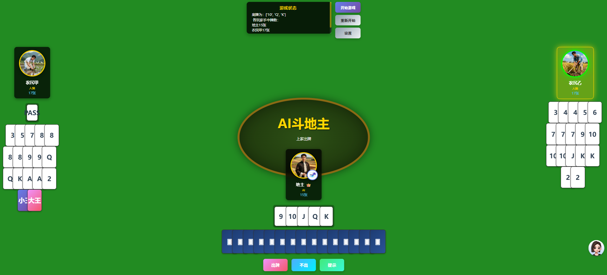

# 斗地主Web前端

欢乐斗地主风格的Web前端界面，支持人类玩家和AI玩家混合对战。

<div align='center'>

</div>

## 功能特点

- 🎮 **欢乐斗地主风格UI** - 绿色牌桌，精美扑克牌设计
- 🤖 **AI与人类混合对战** - 可自由选择每个玩家是AI还是人类
- 🔄 **实时游戏状态** - 使用WebSocket实时同步游戏状态
- 🎯 **智能提示系统** - 为人类玩家提供出牌提示
- 📱 **响应式设计** - 支持不同屏幕尺寸

## 项目结构

```
frontend/
├── app.py                 # Flask后端服务
├── templates/
│   └── index.html        # 主页面HTML
├── static/
│   ├── style.css         # 样式文件
│   ├── game.js           # 游戏主逻辑
│   └── cards.js          # 扑克牌工具类
└── README.md             # 本文件
```

## 安装依赖

```bash
pip install flask flask-socketio flask-cors
```

或使用requirements.txt：

```bash
pip install -r requirements.txt
```

## 运行步骤

1. **确保父目录结构正确**
   ```
   LLMDOUDIZHU/
   ├── frontend/           # 前端目录
   ├── Agent/              # Agent模块
   ├── Environment/        # 环境模块
   └── utils.py           # 工具模块
   ```

2. **进入frontend目录**
   ```bash
   cd frontend
   ```

3. **启动Flask服务器**
   ```bash
   python app.py
   ```

4. **打开浏览器访问**
   ```
   http://localhost:5000
   ```

## 使用说明

### 开始游戏

1. 点击右上角的**"设置"**按钮
2. 选择每个玩家的类型（人类/AI）
3. 点击**"开始游戏"**按钮

### 游戏操作（人类玩家）

- **选牌**: 点击手牌进行选择，再次点击取消选择
- **出牌**: 选中牌后，点击"出牌"按钮
- **不出**: 点击"不出"按钮跳过
- **提示**: 点击"提示"按钮获取出牌建议

### 界面说明

- **顶部**: 显示游戏状态和底牌信息
- **中间**: 绿色牌桌，显示最后一次出牌
- **左侧**: 农民甲
- **右侧**: 农民乙
- **底部**: 地主（带👑标识）

### 玩家类型设置

- **人类玩家**: 显示完整手牌，需要手动操作
- **AI玩家**: 显示牌背，自动出牌

## 技术栈

### 后端
- **Flask**: Web框架
- **Flask-SocketIO**: WebSocket实时通信
- **Flask-CORS**: 跨域支持

### 前端
- **原生JavaScript**: 游戏逻辑
- **Socket.IO**: WebSocket客户端
- **CSS3**: 样式和动画

## API接口

### HTTP接口

- `GET /` - 主页面
- `POST /api/start_game` - 开始游戏
- `GET /api/game_state` - 获取游戏状态

### WebSocket事件

**客户端发送:**
- `player_action` - 玩家出牌动作

**服务器推送:**
- `connected` - 连接成功
- `game_started` - 游戏开始
- `game_updated` - 游戏状态更新
- `action_failed` - 出牌失败
- `game_over` - 游戏结束
- `error` - 错误信息

## 注意事项

1. **AI响应时间**: AI思考需要时间，请耐心等待
2. **网络连接**: 确保WebSocket连接正常
3. **浏览器兼容**: 建议使用Chrome、Firefox或Edge浏览器
4. **端口占用**: 默认使用5000端口，确保端口未被占用

## 常见问题

### 1. 无法连接到服务器
- 检查Flask服务是否正常运行
- 确认端口5000未被占用
- 检查防火墙设置

### 2. AI不出牌
- 查看终端日志，可能是LLM调用失败
- 检查Agent配置是否正确
- 确保网络连接正常

### 3. 界面显示异常
- 清除浏览器缓存
- 检查静态文件是否正确加载
- 查看浏览器控制台错误信息

## 开发说明

### 修改样式
编辑 `static/style.css` 文件

### 修改游戏逻辑
编辑 `static/game.js` 文件

### 修改扑克牌显示
编辑 `static/cards.js` 文件

### 修改后端逻辑
编辑 `app.py` 文件

## 未来改进

- [ ] 添加音效和背景音乐
- [ ] 添加游戏动画效果
- [ ] 支持多房间对战
- [ ] 添加聊天功能
- [ ] 添加游戏历史记录
- [ ] 支持移动端优化

## 许可证

MIT License
