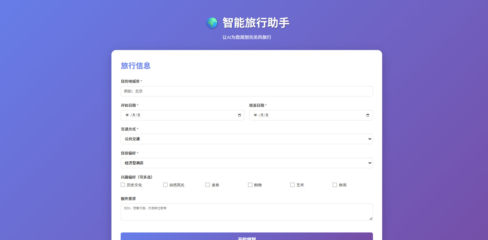

# 🌍 智能旅行助手

基于LLM和MCP的智能旅行规划系统，为用户提供个性化的旅行行程规划。

<div align='center'>

</div>


## ✨ 功能特性

- 🎯 **智能行程规划**：根据用户偏好自动规划旅行行程
- 🏨 **酒店推荐**：基于预算和位置推荐合适的酒店
- 🌤️ **天气查询**：实时查询目的地天气信息
- 🏛️ **景点搜索**：搜索并推荐热门景点，配有精美图片
- 💰 **预算估算**：详细的费用预算分析
- 🗺️ **地图服务**：基于高德地图的路线规划和POI搜索

## 🏗️ 技术架构

### 后端
- **FastAPI**: 高性能Web框架
- **Pydantic**: 数据验证和序列化
- **MCP (Model Context Protocol)**: 调用高德地图服务
- **OpenAI API**: LLM智能推理

### 前端
- **HTML/CSS/JavaScript**: 原生Web技术
- **响应式设计**: 适配各种设备

### 服务集成
- **高德地图API**: POI搜索、路线规划、天气查询
- **Unsplash API**: 景点图片获取
- **Silicon Flow**: LLM服务提供商

## 📦 安装部署

### 1. 克隆项目

```bash
git clone <repository-url>
cd travelassistant
```

### 2. 安装Python依赖

```bash
pip install -r requirements.txt
```

### 3. 安装Node.js依赖（用于MCP）

确保已安装Node.js和npm，MCP服务器会自动通过npx安装。

### 4. 配置环境变量

项目根目录已包含`.env`文件，包含以下配置：

```env
# LLM配置
LLM_MODEL_ID=Qwen/Qwen3-Omni-30B-A3B-Instruct
LLM_API_KEY=your_api_key
LLM_BASE_URL=https://api.siliconflow.cn/v1

# 高德地图配置
AMAP_API_KEY=your_amap_key

# Unsplash配置
UNSPLASH_ACCESS_KEY=your_unsplash_access_key
UNSPLASH_SECRET_KEY=your_unsplash_secret_key

# API配置
API_HOST=0.0.0.0
API_PORT=8000
API_RELOAD=True
```

### 5. 启动服务

```bash
cd backend
python run.py
```

服务将在 `http://localhost:8000` 启动。

## 🚀 使用说明

### Web界面

1. 打开浏览器访问 `http://localhost:8000`
2. 填写旅行信息：
   - 目的地城市
   - 开始和结束日期
   - 交通方式
   - 住宿偏好
   - 兴趣偏好（可多选）
   - 额外要求（可选）
3. 点击"开始规划"按钮
4. 等待系统生成行程计划
5. 查看详细的行程规划结果

### API接口

#### 规划旅行
```http
POST /api/plan
Content-Type: application/json

{
  "city": "北京",
  "start_date": "2025-06-01",
  "end_date": "2025-06-03",
  "travel_days": 3,
  "transportation": "公共交通",
  "accommodation": "经济型酒店",
  "preferences": ["历史文化", "美食"],
  "free_text_input": "想看升旗"
}
```

#### 搜索POI
```http
POST /api/poi/search
Content-Type: application/json

{
  "keywords": "故宫",
  "city": "北京",
  "citylimit": true
}
```

#### 查询天气
```http
GET /api/weather/{city}
```

#### 路线规划
```http
POST /api/route
Content-Type: application/json

{
  "origin_address": "天安门",
  "destination_address": "故宫",
  "origin_city": "北京",
  "destination_city": "北京",
  "route_type": "walking"
}
```

## 📁 项目结构

```
travelassistant/
├── backend/                    # 后端代码
│   ├── app/
│   │   ├── agents/            # Agent层
│   │   │   ├── base_agent.py
│   │   │   ├── attraction_agent.py
│   │   │   ├── hotel_agent.py
│   │   │   ├── weather_agent.py
│   │   │   └── trip_planner_agent.py
│   │   ├── api/               # API路由
│   │   │   ├── main.py
│   │   │   └── routes/
│   │   │       ├── trip.py
│   │   │       ├── poi.py
│   │   │       └── map.py
│   │   ├── models/            # 数据模型
│   │   │   └── schemas.py
│   │   ├── services/          # 服务层
│   │   │   ├── amap_service.py
│   │   │   ├── llm_service.py
│   │   │   └── unsplash_service.py
│   │   ├── config.py          # 配置管理
│   │   └── __init__.py
│   ├── run.py                 # 启动脚本
│   └── requirements.txt       # Python依赖
├── frontend/                  # 前端代码
│   ├── index.html            # 主页面
│   ├── script.js             # JavaScript逻辑
│   └── style.css             # 样式表
├── .env                       # 环境变量
├── 需求文档.md                # 需求文档
└── README.md                  # 项目说明
```

## 🔧 核心组件说明

### Agent系统

1. **TripPlannerAgent**: 行程规划总控Agent，协调其他Agent完成规划
2. **AttractionAgent**: 景点搜索Agent，根据偏好推荐景点
3. **HotelAgent**: 酒店推荐Agent，根据预算和位置推荐酒店
4. **WeatherAgent**: 天气查询Agent，获取目的地天气信息

### 服务层

1. **AmapMCPService**: 高德地图MCP服务封装
2. **LLMService**: LLM调用服务
3. **UnsplashService**: 图片搜索服务

### 数据流程

```
用户输入 → API路由 → TripPlannerAgent
                           ↓
              ┌─────────────┼─────────────┐
              ↓             ↓             ↓
    AttractionAgent  WeatherAgent  HotelAgent
              ↓             ↓             ↓
         高德地图MCP    高德地图MCP   高德地图MCP
              ↓             ↓             ↓
         Unsplash      天气数据       酒店数据
              └─────────────┼─────────────┘
                           ↓
                    TripPlan生成
                           ↓
                      前端展示
```

## 🎯 设计特点

1. **模块化架构**: 清晰的分层设计，易于维护和扩展
2. **类型安全**: 使用Pydantic进行严格的数据验证
3. **异步处理**: 全异步设计，提高并发性能
4. **MCP协议**: 标准化的外部服务调用
5. **响应式UI**: 美观的用户界面，良好的交互体验

## 📝 注意事项

1. 需要有效的API密钥才能正常运行
2. 高德地图MCP服务需要Node.js环境
3. 首次运行时会自动安装`@modelcontextprotocol/server-gdmaps`
4. 建议使用Python 3.8+版本

## 🛠️ 故障排查

### MCP连接失败
- 检查Node.js是否已安装
- 确认高德地图API密钥是否有效
- 查看终端输出的错误信息

### LLM调用失败
- 检查LLM API密钥是否正确
- 确认网络连接正常
- 查看API配额是否充足

### 图片加载失败
- 检查Unsplash API密钥
- 确认网络可以访问Unsplash服务

## 📄 许可证

MIT License

## 👥 贡献

欢迎提交Issue和Pull Request！

## 📧 联系方式

如有问题，请通过Issue联系。
